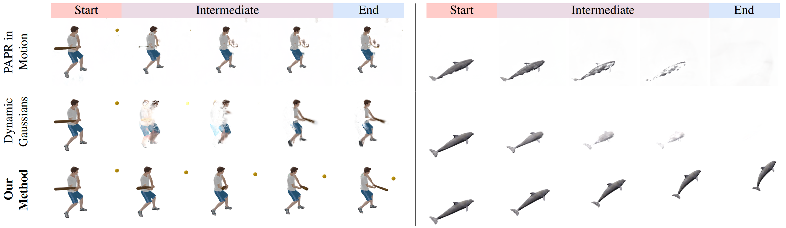
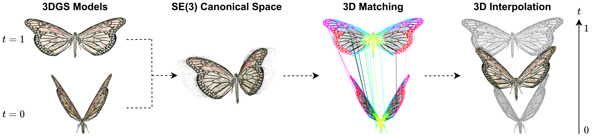

# GMC: Global Motion Corresponder for 3D Point-Based Scene Interpolation under Large Motion

Junru Lin*, Chirag Vashist*, Mikaela Angelina Uy, Colton Stearns, Xuan Luo, Leonidas Guibas, Ke Li

[\[Webpage\]](https://junrul.github.io/gmc/) [\[Paper\]](https://arxiv.org/pdf/2508.20136) [\[Video Presentation\]](https://www.youtube.com/watch?v=XeEVJViTsbw&embeds_referring_euri=https%3A%2F%2Fjunrul.github.io%2F&source_ve_path=OTY3MTQ)



**TLDR:** Existing 3D scene interpolation methods fail when the scene undergoes large global motion. To address this, we propose a novel approach that robustly handles such motions by learning smooth global correspondences in a canonical space.

## Method Overview

We use Gaussian splats as our representations. First, two 3D Gaussian Splatting (3DGS) models are trained from the start state and end state. Then we transform both sets of Gaussians into a learnable shared canonical space where corresponding Gaussians occupy identical spatial locations. This transformations are obtained from Unary Potential Fields, which are learnable MLPs. After optimization, we can obtain per-Gaussian transformation and perform interpolation and extrapolation.


## Environment Setup

### 1. Clone this repository:
```bash
git clone https://github.com/JunruL/GMC.git
cd GMC
```

### 2. Create a conda environment:
```bash
conda env create -f environment.yml
conda activate gmc
```

## Datasets

### 1. GMC Synthetic Scenes
**Description:** Synthetic 3D scenes with object motion for scene interpolation evaluation

**Contents:** 8 diverse synthetic scenes including ball, boat, butterfly, car, dolphin, knight, microwave, and seagull

**Location:** Preprocessed data available in datasets/gmc_synthetic_scenes/

**Source:** Generated from the Objaverse dataset

### 2. GMC Real-World Scenes
**Description:** Real-world object motion scenes captured with cameras

**Contents:** 3 real-world scenes including box, shoe, and tapeline with natural motion

**Location:** Preprocessed data available in datasets/gmc_realworld_scenes/

**Source:** Captured using camera setups

### 3. PAPR Synthetic Scenes
**Description:** Synthetic scenes used for evaluation in PAPR-in-Motion baseline

**Contents:** 6 synthetic scenes including butterfly, crab, dolphin, giraffe, lego, and legoman

**Location:** Preprocessed data available in datasets/papr_synthetic_scenes/

**Source:** Adapted from PAPR-in-Motion evaluation benchmark

### 4. PAPR Real-World Scenes
**Description:** Real-world scenes used for evaluation in PAPR-in-Motion baseline

**Contents:** 2 real-world scenes including lamp and stand with natural object motion

**Location:** Preprocessed data available in datasets/papr_realworld_scenes/

**Source:** Adapted from PAPR-in-Motion evaluation benchmark

### 5. DynamicGaussian Real-World Scenes
**Description:** Real-world scenes with dynamic motion for scene interpolation

**Contents:** 3 real-world scenes including boxes, football, and softball with natural motion

**Location:** Preprocessed data available in datasets/dynamicgaussian_realworld_scenes/

**Source:** Adapted from DynamicGaussian evaluation benchmark

## Data Preparation

### 1. Download Data

```bash
sh download_data.sh
```

### 2. Dataset Structure
We follow the NeRF/Blender convention and the data structure is as following:

```
datasets/
└── <dataset_name>/
    └── <scene_name>/
        ├── start/
        │   ├── train/                      # training images
        │   ├── test/                       # test images
        │   ├── transforms_train.json       # training camera transforms
        │   ├── transforms_test.json        # test camera transforms
        └── end/
            ├── train/
            ├── test/
            ├── transforms_train.json
            └── transforms_test.json
```

## Project Structure

```
GlobalMotionCorresponder/
├── assets/                          # Images and media files for documentation
│   ├── teaser.png                   # Teaser image for the project
│   └── method_overview.png          # Method overview diagram
├── arguments/                       # Argument parsing utilities
├── cleanfid/                        # FID evaluation utilities (adapted from clean-fid)
├── configs/                         # YAML configuration files for experiments
│   ├── gmc_synthetic_scenes/        # Configs for GMC synthetic scene experiments
│   ├── gmc_realworld_scenes/        # Configs for GMC real-world scene experiments
│   ├── papr_synthetic_scenes/       # Configs for PAPR synthetic baselines
│   ├── papr_realworld_scenes/       # Configs for PAPR real-world baselines
│   └── dynamicgaussian_realworld_scenes/  # Configs for DynamicGaussian real-world baselines
├── datasets/                        # Preprocessed dataset files
│   ├── gmc_synthetic_scenes/        # Synthetic scenes for GMC evaluation
│   ├── gmc_realworld_scenes/        # Real-world scenes for GMC evaluation
│   ├── papr_synthetic_scenes/       # PAPR-in-Motion synthetic baselines
│   ├── papr_realworld_scenes/       # PAPR-in-Motion real-world baselines
│   └── dynamicgaussian_realworld_scenes/  # DynamicGaussian baselines
├── dino_utils/                      # DINO feature extraction utilities
│   └── pretrained_models/           # Pretrained DINO models
├── gmc_models/                      # GMC model implementations
├── gmc_utils/                       # GMC-specific utility functions
│   ├── config.py                    # Configuration management
│   ├── eval_utils.py                # Evaluation utilities
│   ├── loss_utils.py                # Loss function implementations
│   └── vis_utils.py                 # Visualization utilities
├── output/                          # Training outputs and checkpoints
├── scene/                           # 3D Gaussian Splatting scene management
│   ├── gaussian_model.py            # Gaussian model implementation
│   └── cameras.py                   # Camera utilities
├── utils/                           # General utility functions
│   ├── camera_utils.py              # Camera-related utilities
│   ├── graphics_utils.py            # Graphics and rendering utilities
│   ├── loss_utils.py                # General loss functions
│   └── sh_utils.py                  # Spherical harmonics utilities
├── demo.sh                          # Demo script for quick testing
├── download_data.sh                 # Script to download datasets
├── environment.yml                  # Conda environment specification
├── eval_gmc.py                      # GMC model evaluation script
├── generate_dino.py                 # DINO feature generation script
├── train_gmc.py                     # GMC model training script
├── train_gs.py                      # 3D Gaussian Splatting training script
├── vis_gmc.py                       # GMC visualization script
└── README.md                        # This documentation file
```

### Key Scripts and Files
- **`train_gs.py`**: Trains 3D Gaussian Splatting models for individual scenes
- **`train_gmc.py`**: Trains the GMC (Global Motion Corresponder) model for scene interpolation
- **`eval_gmc.py`**: Evaluates GMC model performance using metrics like SI-EMD, SI-MPED, SI-FID
- **`vis_gmc.py`**: Visualizes GMC interpolation results
- **`generate_dino.py`**: Extracts DINO features for semantic guidance
- **`demo.sh`**: Quick demo script for testing the pipeline
- **`download_data.sh`**: Downloads and prepares datasets


## Quick Demo
This includes a demo for `gmc_synthetic_scenes/ball` scene.
```bash
sh demo.sh
```


## Step-by-Step Training, Visualization, and Testing


### 1. Extract DINO Features:

```bash
python generate_dino.py --data_dir datasets/<dataset_name>/<scene_name>/start/train
python generate_dino.py --data_dir datasets/<dataset_name>/<scene_name>/end/train
```

This will generate DINO features, a PCA model, and a random projection model, which will be saved in `datasets/<dataset_name>/<scene_name>/<start_or_end>/train/dino`.

### 2. Train 3D Gaussian Splatting Models

First, train separate 3DGS models for each scene state:

```bash
# Train 3DGS for state 1
python train_gs.py \
    --source_path <path_to_state1_dataset> \
    --semantic_feature_dir <dino_features_dir_name> \
    --rp_file <path_to_rp_file> \
    --pca_file <path_to_pca_file> \
    --model_path <model_output_dir> \
    --white_background

# Train 3DGS for state 2
# rp_file and pca_file should be the same as the state 1
python train_gs.py \
    --source_path <path_to_state2_dataset> \
    --semantic_feature_dir <dino_features_dir_name> \
    --rp_file <path_to_rp_file> \
    --pca_file <path_to_pca_file> \
    --model_path <model_output_dir> \
    --white_background
```

<details>
  <summary>Command Line Arguments</summary>

  **Essential Arguments:**
  - `--source_path / -s`: Path to the source directory containing a COLMAP or Synthetic NeRF dataset
  - `--semantic_feature_dir`: Directory containing pre-computed semantic features (DINO features) for the dataset
  - `--rp_file`: Path to the random projection model file for feature dimensionality reduction
  - `--pca_file`: Path to the PCA model file for feature dimensionality reduction
  - `--rp_dim`: Dimensionality of the random projection space (default: 16)
  - `--pca_dim`: Dimensionality of the PCA space (default: 4)
  - `--model_path / -m`: Path where the trained model should be stored (output/<random> by default)
  - `--white_background / -w`: Use white background instead of black for rendering (e.g., for NeRF Synthetic dataset evaluation)
  - `--isotropic`: Force all Gaussians to be isotropic (spherical) rather than anisotropic
  - `--f_weight`: Weight coefficient for the semantic feature loss term in the total loss function (default: 0.01)

  **Training Control:**
  - `--iterations`: Number of total iterations to train for (default: 30,000)
  - `--test_iterations`: Space-separated iterations at which to compute L1 and PSNR over test set (default: [5_000, 10_000, 20_000, 30_000])
  - `--save_iterations`: Space-separated iterations at which to save the Gaussian model (default: [30_000])
  - `--checkpoint_iterations`: Space-separated iterations at which to store a checkpoint for continuing later
  - `--start_checkpoint`: Path to a saved checkpoint to continue training from

  **Optimization Parameters:**
  - `--position_lr_init`: Initial 3D position learning rate (default: 0.00016)
  - `--position_lr_final`: Final 3D position learning rate (default: 0.0000016)
  - `--position_lr_delay_mult`: Position learning rate multiplier (cf. Plenoxels) (default: 0.01)
  - `--position_lr_max_steps`: Number of steps where position learning rate goes from initial to final (default: 30,000)
  - `--feature_lr`: Spherical harmonics features learning rate (default: 0.0025)
  - `--opacity_lr`: Opacity learning rate (default: 0.05)
  - `--scaling_lr`: Scaling learning rate (default: 0.005)
  - `--rotation_lr`: Rotation learning rate (default: 0.001)
  - `--semantic_feature_lr`: Learning rate for semantic features (default: 0.001)
  - `--lambda_dssim`: Influence of SSIM on total loss from 0 to 1 (default: 0.2)

  **Densification Parameters:**
  - `--densification_interval`: How frequently to densify (every N iterations) (default: 100)
  - `--opacity_reset_interval`: How frequently to reset opacity (default: 3,000)
  - `--densify_from_iter`: Iteration where densification starts (default: 500)
  - `--densify_until_iter`: Iteration where densification stops (default: 15,000)
  - `--densify_grad_threshold`: Limit that decides if points should be densified based on 2D position gradient (default: 0.0002)
  - `--percent_dense`: Percentage of scene extent (0-1) a point must exceed to be forcibly densified (default: 0.01)

  **Data and Rendering:**
  - `--images / -i`: Alternative subdirectory for COLMAP images (default: "images")
  - `--resolution / -r`: Specifies resolution of loaded images before training. If 1, 2, 4 or 8, uses original, 1/2, 1/4 or 1/8 resolution. For other values, rescales width to given number while maintaining aspect. If not set and input width exceeds 1.6K pixels, automatically rescales to this target.
  - `--data_device`: Specifies where to put source image data, cuda by default, recommended to use cpu if training on large/high-resolution dataset to reduce VRAM consumption (but slightly slower training)
  - `--eval`: Use MipNeRF360-style training/test split for evaluation
  - `--sh_degree`: Order of spherical harmonics to be used (no larger than 3) (default: 3)
  - `--random_background`: Use random background colors during training (default: False)

  **Debugging and Pipeline:**
  - `--detect_anomaly`: Enable PyTorch anomaly detection for debugging (default: False)
  - `--quiet`: Suppress any text written to standard output
  - `--debug`: Enables debug mode if you experience errors. If rasterizer fails, creates a dump file for issue reporting
  - `--debug_from`: Iteration (starting from 0) after which debugging becomes active (default: -1, meaning disabled)
  - `--convert_SHs_python`: Make pipeline compute forward and backward of SHs with PyTorch instead of CUDA
  - `--compute_cov3D_python`: Make pipeline compute forward and backward of 3D covariance with PyTorch instead of CUDA
  
</details>


### 3. Train GMC Model
After training the 3DGS models, create configuration files (`base.yaml` and `expname.yaml`), then train the GMC model:

```bash
python train_gmc.py <path_to_exp_config.yaml>
```

GMC uses YAML configuration files. You can also override configuration values via command line arguments. See `gmc_utils/config.py` for all available configuration options.

<details>
  <summary>GMC Configuration Options</summary>

  **Logging and Experiment Setup:**
  - `--log.expname`: Experiment name (default: "test")
  - `--log.out_dir`: Output directory for results (default: "output/tmp")
  - `--log.gmc_ckpt_freq`: Frequency to save GMC checkpoints (default: 10000)
  - `--log.wandb_tags`: Comma-separated list of wandb tags
  - `--log.log_energy_term_loss`: Enable logging of energy term loss (default: False)

  **Training Parameters:**
  - `--train.load_gmc_ckpt_path`: Path to resume GMC training from checkpoint
  - `--train.batch_size`: Batch size for training (default: 20000)
  - `--train.total_iteration`: Total number of training iterations (default: 40000)
  - `--train.joint_start_iteration`: Iteration to start joint optimization (default: 20000)

  **Joint Training Settings:**
  - `--joint.turn_on_desify_prune`: Enable densification and pruning (default: True)
  - `--joint.turn_on_desify`: Enable densification during joint training (default: True)
  - `--joint.desify_prune_iters`: Number of iterations for densification/pruning (default: 10000)

  **Loss Weights:**
  - `--loss.self_render_loss_weight`: Weight for self-rendering loss (default: 1.0)
  - `--loss.cross_render_loss_weight`: Weight for cross-rendering loss (default: 1.0)
  - `--loss.lpips_weight`: Weight for LPIPS perceptual loss (default: 0.2)
  - `--loss.self_local_distance_weight_start`: Initial weight for self local distance loss (default: 0.0)
  - `--loss.self_local_distance_weight_end`: Final weight for self local distance loss (default: 20.0)
  - `--loss.self_local_distance_weight_steps`: Steps to ramp up self local distance weight (default: 20000)
  - `--loss.cross_local_distance_weight_start`: Initial weight for cross local distance loss (default: 0.0)
  - `--loss.cross_local_distance_weight_end`: Final weight for cross local distance loss (default: 20.0)
  - `--loss.cross_local_distance_weight_steps`: Steps to ramp up cross local distance weight (default: 20000)
  - `--loss.local_agree_loss_neighbour_num`: Number of neighbors for local agreement loss (default: 256)

  **Gaussian Splatting Settings:**
  - `--gs.checkpoint1`: Path to checkpoint file for first scene
  - `--gs.checkpoint2`: Path to checkpoint file for second scene
  - `--gs.pretrained_frame1_dir`: Directory containing pretrained GS model for first scene
  - `--gs.pretrained_frame2_dir`: Directory containing pretrained GS model for second scene
  - `--gs.load_iteration`: Iteration number to load from checkpoint (default: 30000)
  - `--gs.checkpoint1_gt`: Path to ground truth checkpoint for first scene
  - `--gs.checkpoint2_gt`: Path to ground truth checkpoint for second scene
  - `--gs.feat_dim`: Feature dimension (default: 384)
  - `--gs.rp_dim`: Random projection dimension (default: 16)
  - `--gs.pca_dim`: PCA dimension (default: 4)

  **Gaussian Splatting Learning Rates:**
  - `--gs.lr.fgs_xyz_lr`: Learning rate for Gaussian positions (default: 0.000016)
  - `--gs.lr.fgs_f_dc_lr`: Learning rate for DC color components (default: 0.0001)
  - `--gs.lr.fgs_f_rest_lr`: Learning rate for higher-order color components (default: 0.0001)
  - `--gs.lr.fgs_opacity_lr`: Learning rate for opacity values (default: 0.05)
  - `--gs.lr.fgs_scaling_lr`: Learning rate for scaling parameters (default: 0.005)
  - `--gs.lr.fgs_rotation_lr`: Learning rate for rotation parameters (default: 0.0)
  - `--gs.lr.fgs_semantic_feature_lr`: Learning rate for semantic features (default: 0.0001)

  **GMC Model Parameters:**
  - `--gmc.init_trans_zero`: Initialize transformations as zero (default: False)
  - `--gmc.dropout_ratio`: Dropout ratio in GMC model (default: 0.2)
  - `--gmc.xyz_input_scale`: Scaling factor for XYZ input features (default: 1.0)
  - `--gmc.dino_input_scale`: Scaling factor for DINO input features (default: 1.0)
  - `--gmc.learning_rate`: Learning rate for GMC model (default: 0.0005)

  **Database Parameters:**
  - `--database.color_dist_weight`: Weight for color distance in database queries (default: 1.0)
  - `--database.feat_dist_weight`: Weight for feature distance in database queries (default: 1.0)
  - `--database.xyz_dist_weight`: Weight for XYZ distance in database queries (default: 10.0)
  - `--database.noise_type`: Type of noise to add ('gumbel' or 'zero', default: 'gumbel')
  - `--database.noise_gumbel_mu`: Gumbel noise mean parameter (default: 0)
  - `--database.noise_gumbel_beta`: Gumbel noise scale parameter (default: 0.1)
  - `--database.fg_info_path`: Path to point cloud file with foreground information

</details>


### 4. Visualization

```bash
python vis_gmc.py <path_to_exp_config.yaml>
```

Visualization uses the same YAML configuration system as training. Key parameters for visualization include:
<details>
  <summary>Visualization Configuration Options</summary>

  **Visualization Settings:**
  - `--vis.load_iteration`: Iteration to load for visualization (default: 40000)
  - `--vis.white_background`: Use white background for visualization (default: False)
  - `--vis.render_skip_every`: Skip every N frames in video rendering (default: 20)
  - `--vis.video_view_id`: Camera view ID for video generation (default: 0)

</details>

### 5. Scene Interpolation Evaluation (SI-EMD, SI-MPED, SI-FID)

```bash
python eval_gmc.py <path_to_exp_config.yaml>
```

Evaluation uses the same YAML configuration system as training. Key parameters for evaluation include:
<details>
  <summary>Evaluation Configuration Options</summary>

  **Evaluation Settings:**
  - `--eval.load_iteration`: Iteration to load for evaluation (default: 10000)
  - `--eval.max_pt`: Maximum number of points for evaluation (default: 2000)

  **Evaluation Metrics:**
  - **SI-EMD**: point cloud interpolation evaluation metric
  - **SI-MPED**: point cloud interpolation evaluation metric
  - **SI-FID**: rendering quality evaluation metric during the interpolation

</details>


## Citation

If you find this work useful in your research, please cite:

```bibtex
@InProceedings{GMC,
    author    = {Lin, Junru and Vashist, Chirag and Uy, Mikaela Angelina and Stearns, Colton and Luo, Xuan and Guibas, Leonidas and Li, Ke},
    title     = {Global Motion Corresponder for 3D Point-Based Scene Interpolation under Large Motion},
    booktitle = {Proceedings of the IEEE/CVF International Conference on Computer Vision (ICCV)},
    month     = {October},
    year      = {2025},
    pages     = {7884-7893}
}
```

## Acknowledgments

This project builds upon [3D Gaussian Splatting](https://repo-sam.inria.fr/fungraph/3d-gaussian-splatting/), [Feature 3DGS](https://github.com/ShijieZhou-UCLA/feature-3dgs), [DINO](https://github.com/facebookresearch/dino), and [gsplat](https://github.com/nerfstudio-project/gsplat). Our evaluation pipeline uses code shared by the authors of [PAPR in Motion](https://github.com/niopeng/PAPR-in-Motion), which includes components adapted from the [clean-fid](https://github.com/GaParmar/clean-fid) repository.
